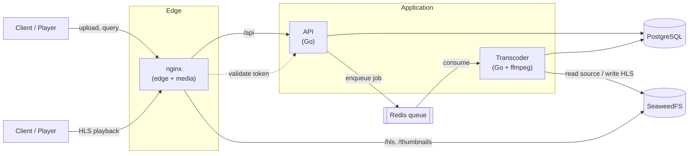

<div align="center">

# EvadePlayer

### Fast, simple, and convenient backend for your video player.

Upload videos, transcode them to HLS, and get ready-to-use, signed playback URLs by ID.

[](https://github.com/evadepw/evadeplayer-platform/actions/workflows/go.yml)
[](https://go.dev)
[](https://docs.docker.com/compose/)
[](api/openapi.yaml)
[](LICENSE)
[](#project-status)
[](#contributing)

[Quick Start](#quick-start) ·
[Architecture](#architecture) ·
[API](#api-reference) ·
[Configuration](#configuration) ·
[Roadmap](#roadmap)

</div>

---

> [!WARNING]
> **Project status: WIP.** EvadePlayer is under active development. The API and
> configuration are still subject to change before a tagged `v1.0` release.
> It is usable today, but pin to a commit if you depend on it.

## About

EvadePlayer is a self-hosted backend for video playback. You give it a video file;
it gives you back an HLS stream and a signed URL you can hand straight to any player.

It is built around two small Go binaries — an **API** and a **transcoder worker** — so
the heavy lifting (ffmpeg) can scale and even run on a separate GPU box, while the API
stays light. Media is served directly by **nginx** from object storage, so playback
traffic never touches the application layer.

It handles the whole pipeline end to end:

- 📤 Video upload through a simple REST API
- 🎞️ ffmpeg transcoding to multi-quality HLS
- 🔊 Automatic multi-audio-track and subtitle (WebVTT) extraction
- 🖼️ Preview sprites for timeline scrubbing
- 🔐 Signed playback URLs with a short TTL
- 🚀 Direct media delivery via nginx

> Frontend lives separately — bring your own player UI or wire up a dedicated frontend repo.

## Features

| | |
|---|---|
| **Simple REST API** | Upload, list, fetch, status — documented with OpenAPI 3.1 + Swagger UI. |
| **HLS streaming** | Adaptive bitrate with pre-signed, expiring URLs (4 h TTL by default). |
| **Codecs** | H.264, H.265 and AV1 — configurable per deployment. |
| **GPU acceleration** | NVIDIA NVENC and VAAPI, with ready-made Docker Compose overlays. |
| **Multi-audio & subtitles** | Extra audio tracks become HLS audio renditions; text subtitles convert to WebVTT. |
| **Preview sprites** | Storyboard endpoint + sprite generation for hover/scrub thumbnails. |
| **Named segments** | Upload a JSON map (`intro`, `credits`, `ad`…) and fetch it back per video. |
| **Flexible auth** | Service-token auth for uploads; public or key-gated reads via a single flag. |
| **Distributed transcoding** | Run the transcoder on a separate machine; the API just enqueues jobs. |

## Architecture



**Flow**

1. Client uploads a video with a service key → `POST /api/videos/upload`.
2. The API stores a record and enqueues a job on Redis.
3. The transcoder picks up the job and runs ffmpeg: HLS variants, audio/subtitle renditions, preview sprites.
4. Output is written to SeaweedFS; metadata (duration, resolution, progress) is written back to PostgreSQL.
5. The API returns a signed `manifest_url` once `status = ready`.
6. The player fetches the manifest and segments via nginx, which validates each token against the API before serving from storage.

### Repository layout

```
api/          REST API service (Go) + openapi.yaml
transcoder/   ffmpeg transcoding worker (Go)
nginx/        Edge config: routing, signed-media delivery, Swagger UI
migrations/   PostgreSQL schema migrations
*.yml         Docker Compose: base + nvidia / vaapi / standalone transcoder
setup.sh      Interactive configurator (generates .env, builds, deploys)
```

## Quick Start

**Requirements:** Docker + Docker Compose. That's it — Go and ffmpeg run inside containers.

```bash
git clone https://github.com/evadepw/evadeplayer-platform.git
cd evadeplayer-platform
./setup.sh
```

`setup.sh` walks you through configuration interactively: it generates a `.env`
(auto-creating secrets for `SERVICE_KEY` and `HLS_TOKEN_SECRET`), lets you pick CPU /
NVIDIA / VAAPI acceleration, and can build and start everything for you. It can also
configure a machine to run **only** the transcoder against a remote API.

Once it's up, upload a video:

```bash
curl -X POST http://localhost/api/videos/upload \
  -H "X-Service-Key: $SERVICE_KEY" \
  -F file=@video.mp4
# → { "id": "a1b2c3d4-…", "status": "pending" }
```

Poll until it's ready, then grab the manifest:

```bash
curl http://localhost/api/videos/{id}
```

```json
{
  "id": "a1b2c3d4-...",
  "status": "ready",
  "progress": 100,
  "duration": 3723.5,
  "width": 1920,
  "height": 1080,
  "manifest_url": "http://localhost/hls-proxy/a1b2c3d4-.../master.m3u8?token=...&expires=...",
  "preview_url": "http://localhost/thumbnails/a1b2c3d4-.../preview.jpg"
}
```

Pass `manifest_url` straight to your HLS player. Interactive API docs are served at
**`http://localhost/swagger/`**.

### Common commands

```bash
make up        # build + start the full stack
make logs      # tail logs
make migrate   # run database migrations
make test      # run the Go test suites
make down      # stop everything
```

## API Reference

Base path is `/api` when served through nginx (the default deployment). Full,
always-up-to-date spec lives in [`api/openapi.yaml`](api/openapi.yaml) and renders at
`/swagger/`.

| Method | Path | Auth | Description |
|--------|------|------|-------------|
| `POST` | `/videos/upload` | Service key | Upload a video (optional `segments` JSON field) |
| `GET`  | `/videos` | Public / key | List videos (`page`, `page_size`) |
| `GET`  | `/videos/{id}` | Public / key | Video details + `manifest_url` |
| `GET`  | `/videos/{id}/status` | Public / key | Transcode status + progress |
| `GET`  | `/videos/{id}/storyboard` | Public / key | Sprite cues for scrubbing |
| `GET`  | `/videos/{id}/segments` | Public / key | Named time intervals for the video |
| `GET`  | `/videos/{id}/download` | Public / key | Download the original file |
| `GET`  | `/healthz` | — | Health check |

A video's `status` moves through `pending → processing → ready` (or `failed`).
The `manifest_url` is only present once `status = ready`.

## Authentication

Uploads (`POST /videos/upload`) **always** require the `X-Service-Key` header.

Read access is governed by a single flag:

```dotenv
READ_PUBLIC=true     # anyone can fetch video info and manifests (default)
# READ_PUBLIC=false  # X-Service-Key required for reads too

SERVICE_KEY=change-me
HLS_TOKEN_SECRET=change-me
```

Regardless of `READ_PUBLIC`, **HLS manifests and segments are always signed** — tokens
expire after 4 hours, and nginx validates every segment request against the API before
serving bytes.

## Configuration

The most common variables — run `./setup.sh` to set these interactively, or copy
`.env.example`. See `openapi.yaml` / Swagger for the complete list.

| Variable | Description |
|----------|-------------|
| `SERVICE_KEY` | Key required for upload (and reads when `READ_PUBLIC=false`) |
| `HLS_TOKEN_SECRET` | Secret used to sign HLS URLs |
| `READ_PUBLIC` | `true` = open reads, `false` = key required |
| `PUBLIC_HOST` | Public base URL, e.g. `https://cdn.example.com` |
| `NGINX_PORT` | Host port exposed by nginx |
| `MAX_UPLOAD_SIZE_GB` | Max upload size in GB (default: `50`) |
| `CORS_ORIGINS` | Allowed CORS origins |
| `TRANSCODE_ACCEL` | `cpu`, `nvidia`, or `vaapi` |
| `TRANSCODE_CODECS` | e.g. `h264,h265,av1` |
| `TRANSCODE_QUALITIES` | e.g. `360p,720p,1080p` |
| `TRANSCODE_WORKERS` | Number of concurrent transcode jobs |

Storage, database and Redis connection settings (`SEAWEEDFS_*`, `POSTGRES_*`,
`REDIS_*`) are wired up by Compose and `setup.sh` and rarely need manual edits for a
single-host deployment.

## GPU acceleration

```bash
make up                  # CPU (default)
make transcoder-up-nvidia  # NVIDIA NVENC
make transcoder-up-vaapi   # Intel/AMD VAAPI
```

Compose overlays (`docker-compose.nvidia.yml`, `docker-compose.vaapi.yml`) and matching
Dockerfiles ship in the repo. Set `TRANSCODE_ACCEL` accordingly.

## Project status

EvadePlayer is **work in progress**. The core pipeline is functional and covered by Go
tests run in CI on every push, but interfaces may change before a stable release.

### Roadmap

- [x] Upload → HLS transcoding pipeline
- [x] H.264 / H.265 / AV1, with NVENC & VAAPI
- [x] Multi-audio tracks and WebVTT subtitles
- [x] Signed playback URLs + nginx token validation
- [x] OpenAPI 3.1 spec + Swagger UI
- [ ] Tagged `v1.0` with a frozen API
- [ ] Webhooks / callbacks on transcode completion
- [ ] Metrics & observability endpoints
- [ ] Helm chart for Kubernetes deployments

## Contributing

Contributions are welcome. The Go modules in `api/` and `transcoder/` each build and
test independently:

```bash
make test          # API tests
make test-transcoder
```

Open an issue to discuss larger changes before sending a PR, and please keep new
endpoints documented in `openapi.yaml`.

## License

[MIT](LICENSE)
